# 🎓 KMBB College Management System

A web-based College Management System developed using **Flask** and **MySQL** to simplify and automate academic and administrative activities within KMBB College.

---

## 📖 Overview

The KMBB College Management System is designed to manage students, teachers, attendance, notices, internal marks, and academic information through a centralized web application.

The system reduces manual work, improves efficiency, and provides separate modules for administrators, teachers, and students.

---

## ✨ Features

### 👨‍🎓 Student Module

* Student Registration
* Student Login
* Forgot Password
* View Attendance
* View Internal Marks
* View Subject Notes
* Student ID Card

### 👨‍🏫 Teacher Module

* Teacher Registration
* Teacher Login
* Forgot Password
* Take Attendance
* Update Attendance
* Enter Internal Marks
* Upload Subject Notes
* Teacher ID Card

### 🏢 Admin Module

* Admin Login
* Add Students
* Update Students
* Delete Students
* View Students
* Add Teachers
* Update Teachers
* Delete Teachers
* View Teachers
* Manage Notices

---

## 🛠 Technologies Used

* Python
* Flask
* MySQL
* HTML5
* CSS3
* Bootstrap
* JavaScript

---

## 📂 Project Structure

## 📂 Project Structure

```text
KMBB-CMS/
│
├── static/
│   └── images/
│
├── templates/
│   ├── student_login.html
│   ├── teacher_login.html
│   ├── institute_login.html
│   └── ...
│
├── app.py
├── README.md
└── .gitignore
```

---

## 🚀 Installation

1. Clone the repository:

git clone https://github.com/yourusername/kmbb-college-management-system.git

2. Navigate to the project:

cd kmbb-college-management-system

3. Install dependencies:

pip install -r requirements.txt

4. Configure the MySQL database.

5. Run the application:

python app.py

---

## 🔮 Future Scope

* AI Chatbot Integration
* Online Fee Payment System
* Mobile Application
* Email Notifications
* Student Performance Analytics

---

## 👥 Team

**Team Future Builders**

### Team Member:

* Mohit Kumar Shaw (Technical Lead)
* Nageswar Samantray (Research)
* Abhisek Biswal (Presentation Lead)

---

## 📸 Project Screenshots

### 🏠 Home Page

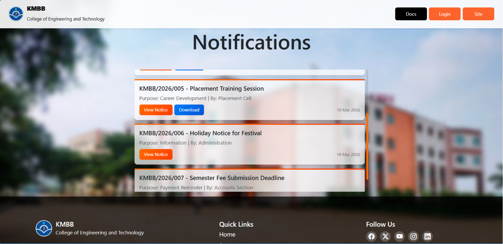

---

### 🔐 Admin Login

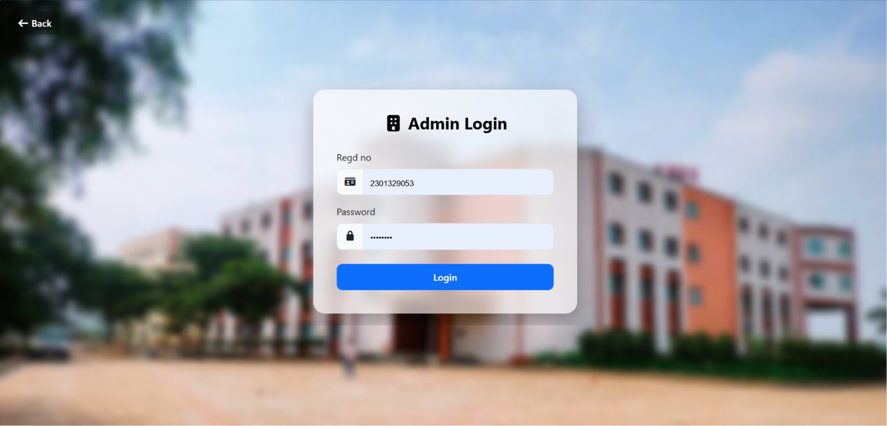

---

### 📊 Admin Dashboard

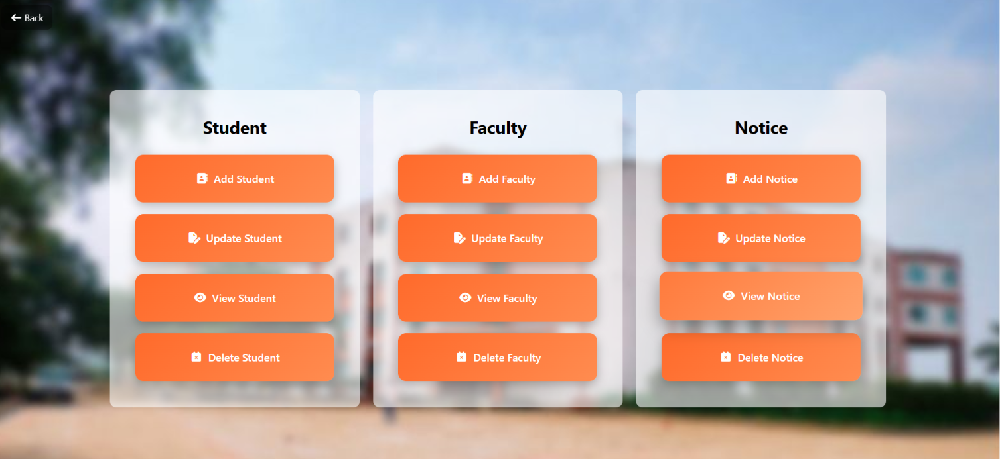

---

### 👨‍🏫 Faculty Login

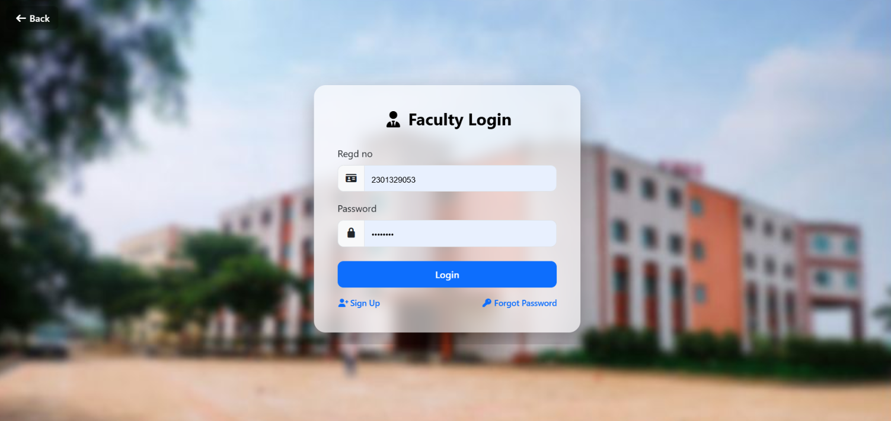

---

### 👨‍🏫 Faculty Dashboard

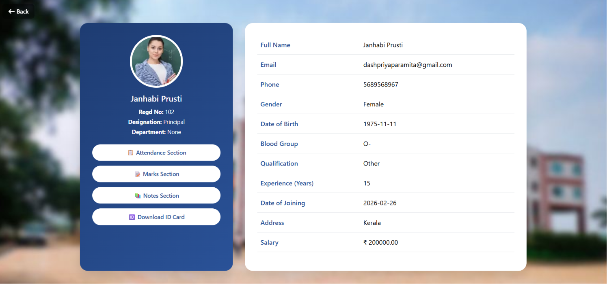

---

### 🎓 Student Login

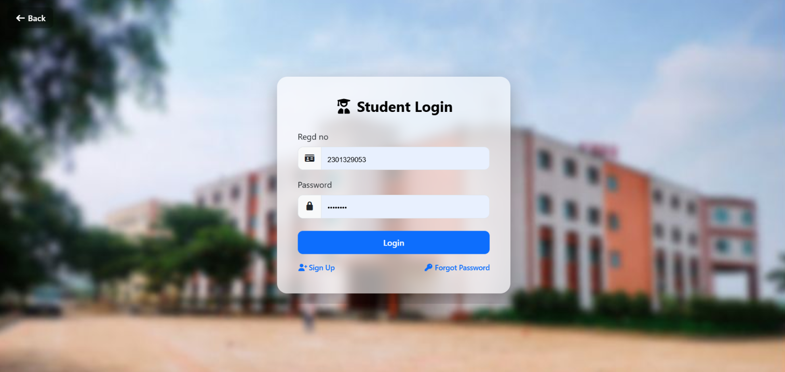

---

### 🎓 Student Dashboard

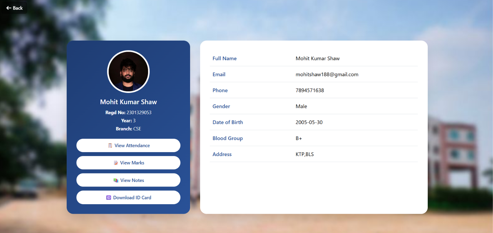

---

### 🪪 Student ID Card

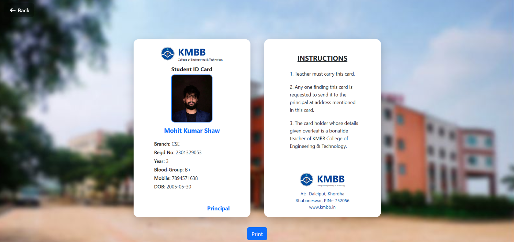

---

### 📅 Attendance Management

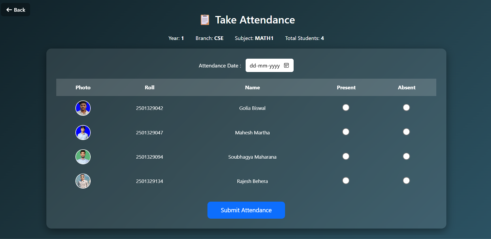

---

### 📝 Mark Sheet

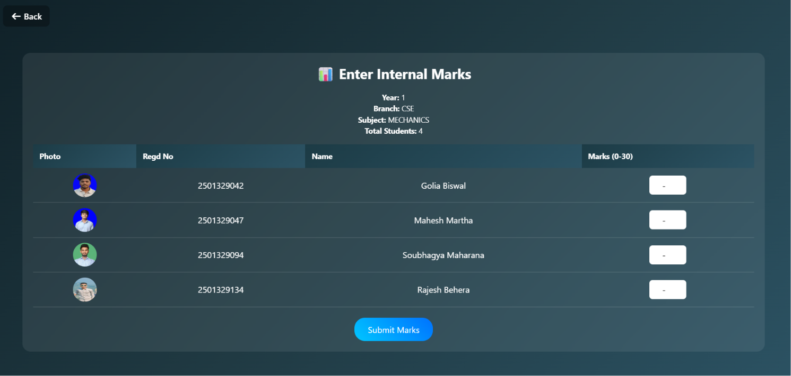

---

### 📢 Notice Board

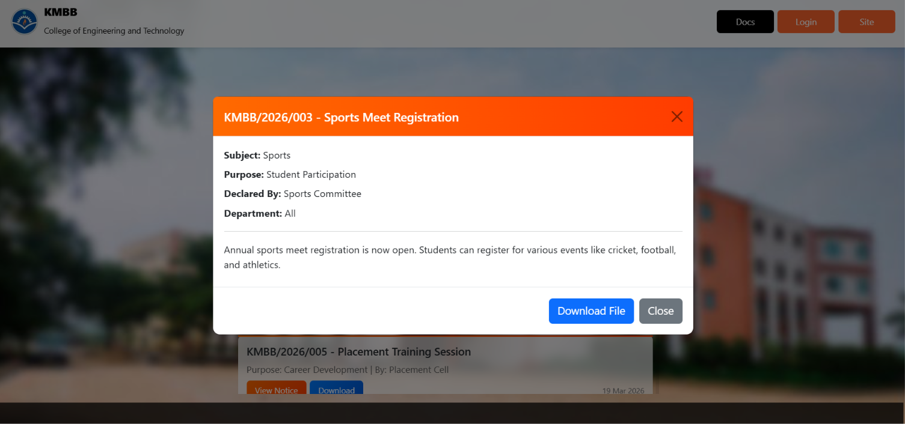


---

## 📜 License

This project is developed for educational purposes.

